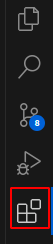
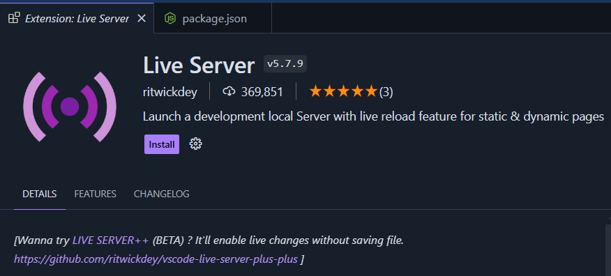
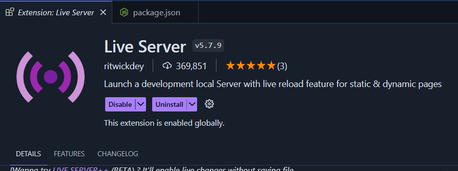

# VS Code Setup

## What Is a Code Editor?

A **code editor** is a tool used to write, edit, and debug code. Good editors come with features like:

- Syntax highlighting
- Code auto-completion
- Error detection
- Built-in terminals

Popular editors include **Sublime Text**, **Notepad++**, and the widely-used **Visual Studio Code (VS Code)**—which we'll be using for this course.

---

## Why Visual Studio Code?

**VS Code**, developed by Microsoft, is one of the most powerful and flexible editors available. It supports many languages and frameworks right out of the box and can be extended with thousands of extensions to suit your workflow.

[Download VS Code](https://code.visualstudio.com/)

---

## Installing Extensions

To make your experience smoother, you'll need to install a few key extensions. Let's start with **Live Server**.

1. Open VS Code
2. Click on the **Extensions** icon in the sidebar (or press `Ctrl + Shift + X`)  
   

3. In the search bar, type: `Live Server`
4. Look for the extension by **ritwickdey**
5. Click **Install**  
   

6. After installation, you'll see something like this:  
   

> _Note: Your VS Code may look different depending on the theme you're using._

## Bonus: Import Recommended Settings

Want to use the exact setup I use?

1. Open VS Code
2. Click **Manage** (⚙️ icon at bottom left) → **Profiles** → **Import Profile**
3. Paste this link:  
   `https://vscode.dev/profile/github/6e17339a353873a71694862c179f0119`
4. Click **Create Profile** to import everything

:::tip
This will include my recommended settings and extensions to help you hit the ground running.
:::
